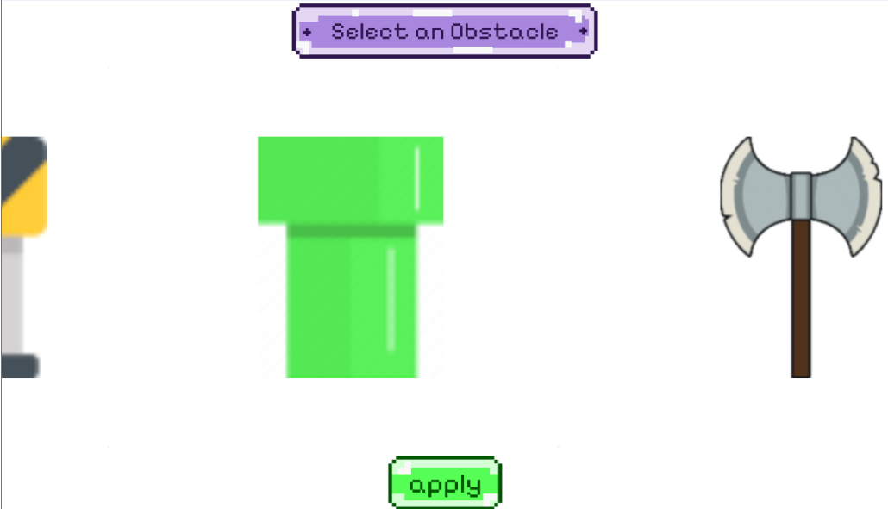

# Introduction

Endless Rush is a small mobile game project built using Xamarin, SkiaSharp, and SQLite. Inspired by the classic Dino game, Endless Rush adds a personal touch—you can customize the character, obstacles, background, and even the music. The game also features a leaderboard, so you can compete for the highest score!

I aimed to implement the MVVM (Model-View-ViewModel) architecture. I'm still learning, so it might not be perfect, but it was a great learning experience.

**Disclamer**
This is a fun side project developed for learning purposes. I do not earn any money from this. 

Music and Artists:
- Catalogue Orders - Miitopia Music - Link: [https://www.youtube.com/watch?v=4m2-2kUYa_w](https://www.youtube.com/watch?v=4m2-2kUYa_w)
- Uhhhhh - MarStarBro - Link: [https://www.youtube.com/watch?v=Hz5oWUeSNxU](https://www.youtube.com/watch?v=Hz5oWUeSNxU)

All music used in this project belongs to the original creators. I do not own the rights to these tracks.

# Installation

 **Download**
 - You can download the zip of this code or you clone it - `git clone https://github.com/srmagar2002/endlessRush.git`

 **Requirements**
 - Visual Studio 2022
  
 **Set up**
 - Open Visual Studio Installer. Click `Modify` and on the `Workloads` tab select `.NET Multi-platform App UI development` and `.NET desktop development`, and on the `Individual components` search Xamarin and select `Xamarin` . Click `Modify`.
  
    

    

 - Open Visual Studio. Click `Open a project or solution`. Navigate to the folder extract of the zip or clone of my code. then select `App25.sln`.
  
 - Click `Tools` tab and go to Android and Click android device manager (ADM). An ADM window pops up and click New. Select any device with resolution of `2560x1600` (e.g. Pixel Tablet, Tablet Xh-DPI, etc.) Then click `Create`.
  
    

    

 - Then start debugging by clicking this green triangle button. (Make sure the name of your android emulator shows up in this button)
        
    

# Other Screenshots

